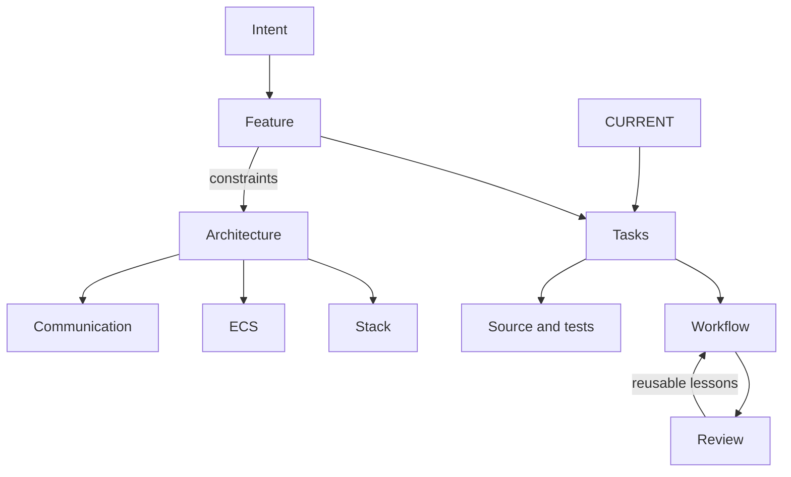

# Project map

- **Purpose.** [Intent](../intend/README.md).
- **Behavior.** [Square feature](../features/001-square.md).
- **Work.** [CURRENT](../CURRENT.md), [task index](../tasks/001-square/README.md).
- **Design.** [Architecture](architecture.md), [communication](communication.md), [stack](tech-stack.md).
- **ECS.** [System map](ecs-systems.md), [patterns](ecs-patterns.md).
- **Process.** [Rules](../RULES.md), [runner](task-runner.md).
- **Language.** [Glossary](glossary.md), [documentation format](../skills/documentation.md).
