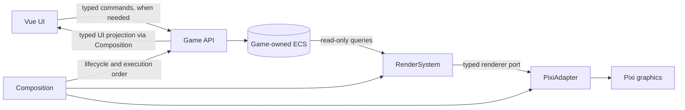

# Shared architecture

Status: Selected; implementation pending.

| Owner | Responsibility |
|---|---|
| Game | Authoritative ECS state, game rules, typed commands and UI queries |
| Vue | Host, controls, UI-only state; displays game-derived projections |
| RenderSystem | Queries visual components; synchronizes create/update/remove through an injected renderer port |
| PixiAdapter | Entity-to-graphic mapping, graphics lifecycle, world-to-screen transform |
| Composition | Dependency wiring, execution order, host resize observation, safe async teardown |
| Game configuration | Logical area dimensions and game-specific component values |

## Decisions and trade-offs

- ECS is the only game model. Pixi objects are presentation resources, not another gameplay hierarchy.
- RenderSystem deliberately depends on ECS components; only PixiAdapter depends on PixiJS. Test RenderSystem with a fake renderer port.
- Prefer direct typed calls. No full-world render snapshots or event bus without a demonstrated need.
- Game API UI projections are derived game data; focus and open panels remain Vue-owned.
- Rendering computes uniform fit from configured logical dimensions: `min(hostWidth / logicalWidth, hostHeight / logicalHeight)`. Device-pixel ratio affects sharpness, not world state.
- Composition disconnects observers and releases resources on teardown, including initialization completing after unmount.
- Introduce commands, simulation cadence, or generalized rendering operations only when required by a feature.

Stack: [tech-stack.md](tech-stack.md). Communication detail: [communication.md](communication.md). Terms: [glossary.md](glossary.md).
