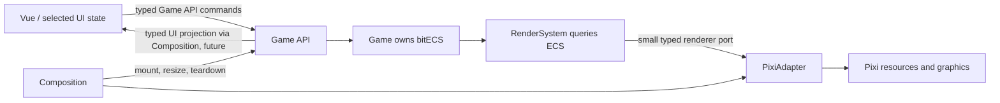

# Vue ↔ Game ↔ presentation

The Game owns bitECS. Vue owns UI-only state (focus, panels). Game-derived UI values flow through typed Game API queries and Composition into Vue; commands flow back through the Game API. Add each contract only when a feature needs it.

| Boundary | Contract | Owner |
|---|---|---|
| Vue → Game | typed commands through Game API | Game validates and updates ECS |
| Game → Vue | typed UI projection via Composition, when needed | Game owns source; Vue displays derived values |
| UI-only state | focus, open panels | Vue |
| ECS → presentation | RenderSystem queries ECS and emits typed create/update/remove operations | RenderSystem |
| presentation → Pixi | small renderer port implemented by PixiAdapter | PixiAdapter |

There is no render snapshot, event bus, or duplicate game hierarchy. RenderSystem reads the authoritative ECS world directly and PixiAdapter maintains only a mapping from ECS entity identifiers to Pixi graphics. That mapping is presentation lifecycle state, not game state.

## Lifecycle

Composition creates the Game and presentation, mounts PixiAdapter, connects resize observation, and requests presentation updates. Resize changes only PixiAdapter's uniform fit. It does not change ECS. Teardown disconnects observers and safely disposes Game and Pixi resources, including resources from initialization that resolves after unmount.

See [shared architecture](architecture.md) for ownership and rendering policy; feature documents supply configuration values.
