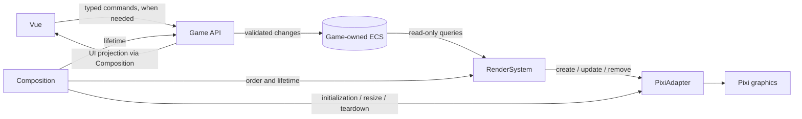

# Communication map

- **UI state.** Game-derived values are projections; focus/panels stay in Vue.
- **Commands.** Added only for interaction; the static square needs none.
- **Authority.** No direct Vue→ECS or UI→renderer synchronization.

[Boundary rationale](architecture.md)
