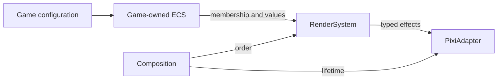

# ECS system map

- **Policy.** Create/update/remove maintain one projection. More loops do not automatically require more systems.
- **Authority.** ECS owns game state; membership and graphics caches are disposable presentation state.
- **Order.** Composition invokes systems; systems do not know each other.
- **Reuse.** Position/size values serve other squares. New shapes or tags require feature demand.

## Sources

- **State.** [Game](../src/game/Game.ts), [components](../src/game/ecs.ts).
- **Projection.** [RenderSystem](../src/render/RenderSystem.ts), [PixiAdapter](../src/render/PixiAdapter.ts).
- **Lifetime.** [Composition](../src/composition.ts).
- **Evidence.** [System tests](../tests/unit/game-render-system.test.ts), [unapplied audit proposals](../tasks/ecs-review/0001-checklist-audit.md).
