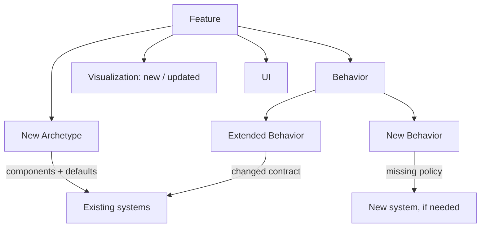

# Feature change types

Use only applicable sections. Keep acceptance criteria in the feature; execution steps in tasks.

## New Archetype

- **Name.** Domain entity type.
- **Description.** Purpose.
- **Components.** Existing data/capabilities; identify additions explicitly.
- **Default behavior.** Existing behavior enabled by those components.
- **Defaults.** Values shared by instances.
- **Initialization.** Instance count, placement, and overrides.

## New Behavior

- **Description.** Missing policy and why existing behavior is insufficient.
- **Archetypes.** Affected entity types.
- **Contract.** Trigger, inputs, effects, constraints.
- **Implementation.** Link shared design; a new behavior does not automatically require a new system.

## Extended Behavior

- **Existing.** Behavior being changed.
- **Archetypes.** Affected entity types.
- **Delta.** New contract versus current behavior.
- **Compatibility.** What must remain unchanged.

## Visualization

- **Change.** New or updated visual representation.
- **Archetypes.** Entities displayed differently.
- **Appearance.** Observable result and style values.
- **Boundary.** Presentation-only change unless game state genuinely changes.

## UI

- **State.** Distinguish game-derived display values from UI-only state.
- **Commands.** User intent sent to Game API.
- **Behavior.** Interaction and feedback.

[Terms](glossary.md) · [Format](../skills/documentation.md)
